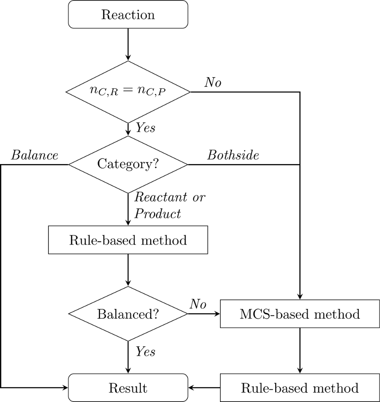

# SynRBL: Synthesis Rebalancing Framework

SynRBL is a toolkit tailored for computational chemistry, aimed at correcting imbalances in chemical reactions. It employs a dual strategy: a rule-based method for adjusting non-carbon elements and an mcs-based (maximum common substructure) technique for carbon element adjustments.




## Table of Contents
- [Installation](#installation)
- [Usage](#usage)
- [Contributing](#contributing)
- [License](#license)
- [Acknowledgments](#acknowledgments)


## Installation

To install and set up the SynRBL framework, follow these steps. Please ensure you have Python 3.11 or later installed on your system.

### Prerequisites

- Python 3.11
- RDKit == 2023.9.4
- joblib==1.3.2
- seaborn==0.13.2
- xgoost==2.0.3
- scikit_learn==1.4.1.post1
- imbalanced_learn==0.12.0
- reportlab==4.1.0


### Step-by-Step Installation Guide

1. **Python Installation:**
  Ensure that Python 3.11 or later is installed on your system. You can download it from [python.org](https://www.python.org/downloads/).

2. **Creating a Virtual Environment (Optional but Recommended):**
  It's recommended to use a virtual environment to avoid conflicts with other projects or system-wide packages. Use the following commands to create and activate a virtual environment:

  ```bash
  python -m venv synrbl-env
  source synrbl-env/bin/activate  # On Windows use `synrbl-env\Scripts\activate`
  ```
  Or Conda

  ```bash
  conda create --name synrbl-env python=3.11
  conda activate synrbl-env
  ```

3. **Install with pip:**
  Clone the SynRBL repository from GitHub and install it:

  ```bash
  pip install synrbl
  ```

4. **Verify Installation:**
  After installation, you can verify that SynRBL is correctly installed by running a simple test or checking the package version.

  ```python
  python -c "import synrbl; print(synrbl.__version__)"
  ```

## Usage
1. **Jupyter Notebook:**
  ```python
  from synrbl import Balancer
  ```
2. **Command line**
  ```bash
  python -m synrbl run --help
  ```

3. **Reproduce the experiment**
  ```bash
  python -m synrbl run -o validation_results.csv -p 4 ./Data/Validation_set/validation_set.csv
  ```

## Contributing
- [Tieu-Long Phan](https://tieulongphan.github.io/)
- [Klaus Weinbauer](https://github.com/klausweinbauer)

## License

This project is licensed under MIT License - see the [License](LICENSE) file for details.

## Acknowledgments

This project has received funding from the European Unions Horizon Europe Doctoral Network programme under the Marie-Skłodowska-Curie grant agreement No 101072930 (TACsy -- Training Alliance for Computational)
