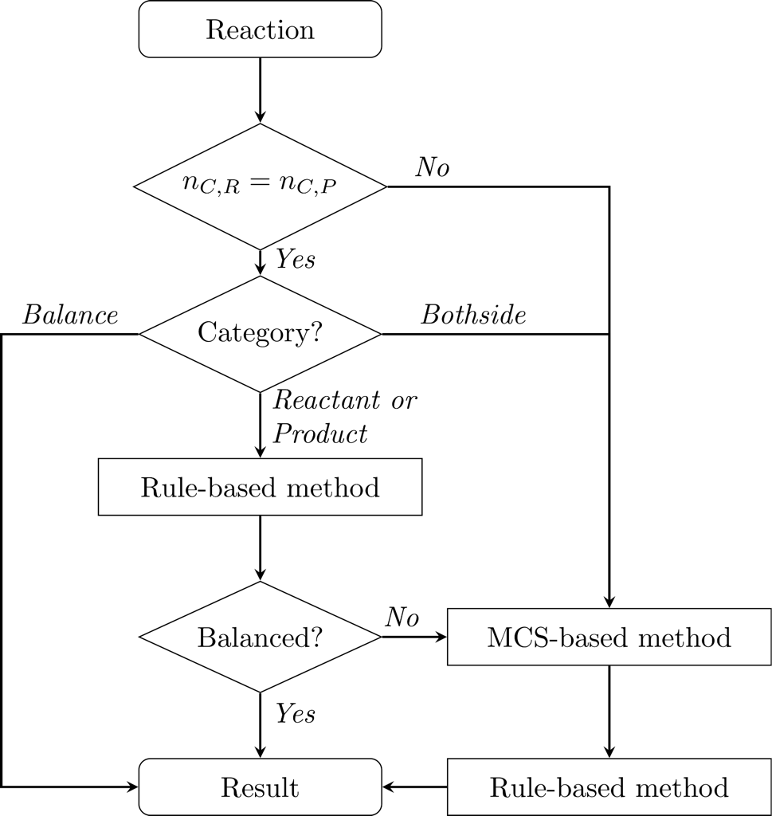

# SynRBL: Synthesis Rebalancing Framework

SynRBL is a toolkit tailored for computational chemistry, aimed at correcting imbalances in chemical reactions. It employs a dual strategy: a rule-based method for adjusting non-carbon elements and an mcs-based (maximum common substructure) technique for carbon element adjustments.




## Table of Contents
- [Repository Structure](#repository-structure)
- [Installation](#installation)
- [Usage](#usage)
- [Contributing](#contributing)
- [License](#license)
- [Acknowledgments](#acknowledgments)

## Repository Structure

SynRBL is organized into several key components, each dedicated to a specific aspect of chemical data processing:

### Main Components

- `SynRBL/`: Main package directory
  - `SynProcessor/`: Data processing module
  - `SynRuleImputer/`: Rule-based imputation module
  - `SynMCSImputer/`: MCS-based imputation module
  - `SynChemImputer/`: MCS-based imputation module
  - `SynVis/`: Data visualization module

### Test Suite

- `tests/`: Test scripts and related files
  - `SynProcessor/`: Tests for SynExtract module
  - `SynRuleImputer/`: Tests for SynRuleImpute module
  - `SynMCSImputer/`: Tests for MCS-based imputation module
  - `SynChemImputer/`: Tests for MCS-based imputation module
  - `SynVis/`: Tests for SynVis module

### Pipeline

- `Pipeline/`: Main scripts
  - `Notebook/`: Jupyter notebook examples
  - `Validation/`: Validation scripts


### Additional Resources

- `License`: License document
- `README.md`: Overview and documentation
- `setup.py`: Installation
- `.gitignore`: Configuration for ignoring certain files and directories

## Installation

To install and set up the SynRBL framework, follow these steps. Please ensure you have Python 3.11 or later installed on your system.

### Prerequisites

- Python 3.11
- RDKit == 2023.9.5
- jobib


### Step-by-Step Installation Guide

1. **Python Installation:**
  Ensure that Python 3.11 or later is installed on your system. You can download it from [python.org](https://www.python.org/downloads/).

2. **Creating a Virtual Environment (Optional but Recommended):**
  It's recommended to use a virtual environment to avoid conflicts with other projects or system-wide packages. Use the following commands to create and activate a virtual environment:

  ```bash
  python -m venv synrbl-env
  source synrbl-env/bin/activate  # On Windows use `synrbl-env\Scripts\activate`
  ```
  Or Conda

  ```bash
  conda create --name synrbl-env python=3.11
  conda activate synrbl-env
  ```

3. **Cloning and Installing SynRBL:**
  Clone the SynRBL repository from GitHub and install it:

  ```bash
  git clone https://github.com/TieuLongPhan/SynRBL.git
  cd SynRBL
  pip install .
  ```

4. **Verify Installation:**
  After installation, you can verify that SynRBL is correctly installed by running a simple test or checking the package version.

  ```python
  python -c "import SynRBL; print(SynRBL.__version__)"
  ```

## Usage

TODO

## Contributing
- [Tieu-Long Phan](https://tieulongphan.github.io/)
- [Klaus Weinbauer](https://github.com/klausweinbauer)

## License

This project is licensed under MIT License - see the [License](LICENSE) file for details.

## Acknowledgments

This project has received funding from the European Union’s Horizon 2021 research and innovation program under the Marie Sklodowska-Curie grant agreement No 101072930 (TACsy – Training Alliance for Computational systems chemistry).